# Explanation methods for deep models

We build demo based on two commonly used explanation methods for deep models, i.e., CAM (Class Activation Map) (Zhou et al., 2016) and Grad-CAM (Selvaraju et al., 2017), which are used to explain a DenseNet169 trained on [MURA (musculoskeletal radiographs, a large dataset of bone X-rays)](https://stanfordmlgroup.github.io/competitions/mura/).

## Test

    python test.py

In our implementation, DenseNet169 has 4 dense blocks followed by a global average pooling layer (GAP) and a fully connection layer (FC). In our demo, we build CAM on the output of 4-st dense block (i.e., output of the last convolutional layer) and build Grad-CAM on the outputs of all four dense blocks.

## Results: CAM VS Grad-CAM

### Instance 1

1. original image

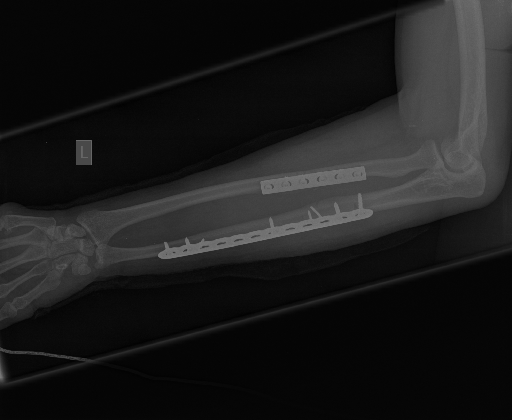

2. CAM built on the output of 4-st dense block

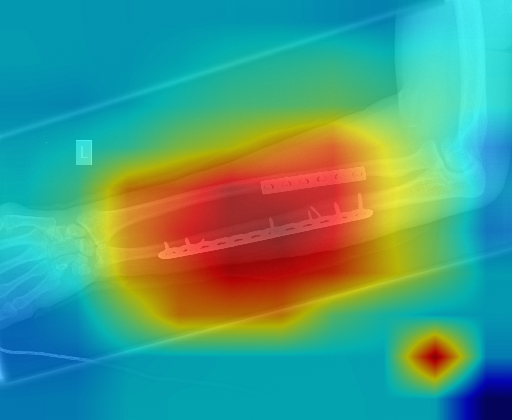

3. Grad-CAM built on the output of 4-st dense block (same as CAM)

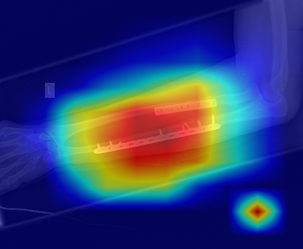

4. Grad-CAM built on the output of 3-st dense block 

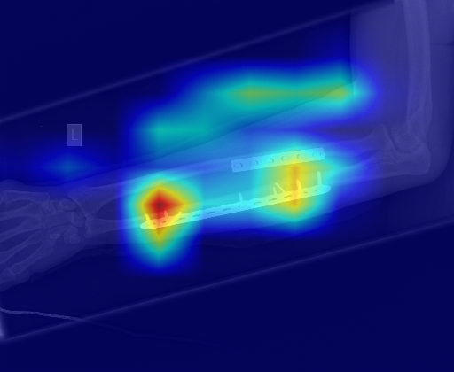

5. Grad-CAM built on the output of 2-st dense block 

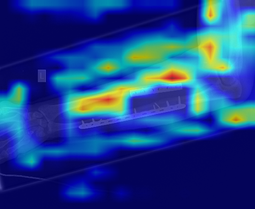

6. Grad-CAM built on the output of 1-st dense block 

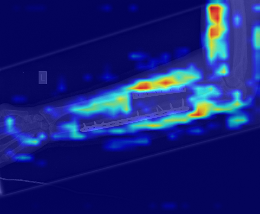

### Instance 2

1. original image

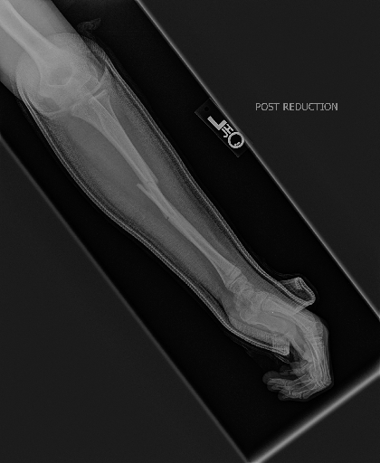

2. CAM built on the output of 4-st dense block

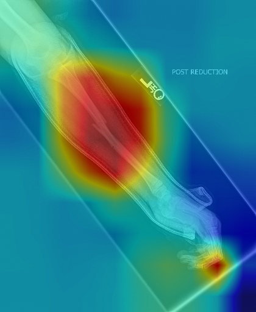

3. Grad-CAM built on the output of 4-st dense block (same as CAM)

4. Grad-CAM built on the output of 3-st dense block 

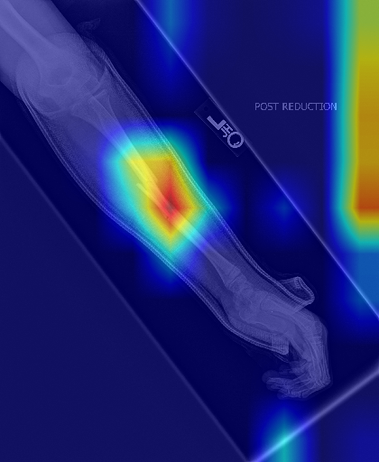

5. Grad-CAM built on the output of 2-st dense block 

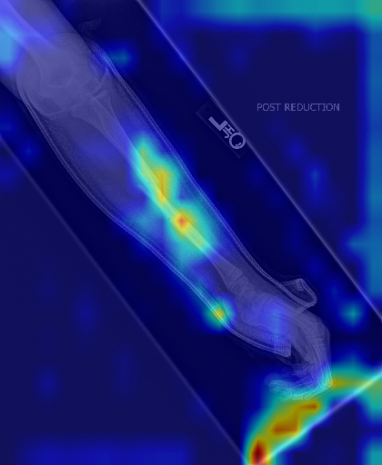

6. Grad-CAM built on the output of 1-st dense block

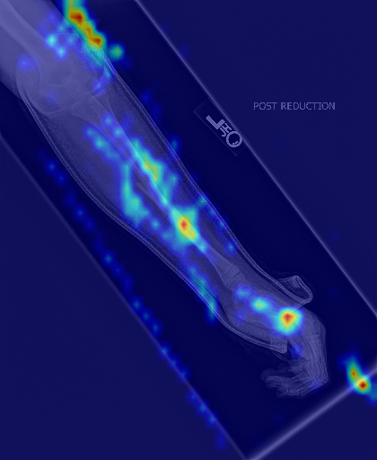

