# Weakly supervised deep learning 

We build two demos. One is weakly supervised object localization based on CAM and Grad-CAM introduced in [00_Interpretability](../00_Interpretability). The other one is weakly supervised semantic segmentation.

## I. Weakly supervised object localization
CAMs generate heatmaps highlighting class-specific discriminative regions. Heatmaps are good for qualitative analysis of the approach. However, for the evaluation of the localization results, well defined region proposals are required. To achieve this, heatmaps (CAMs) are first normalized between 0 and 1, assigning each pixel a value according to its intensity. The high intensity regions are then selected using binary segmentation, giving us the predicted regions as shown below. ([Weakly-supervised localization of diabetic retinopathy lesions in retinal fundus images](https://arxiv.org/abs/1706.09634))

1. CAM built on the output of 4-st dense block

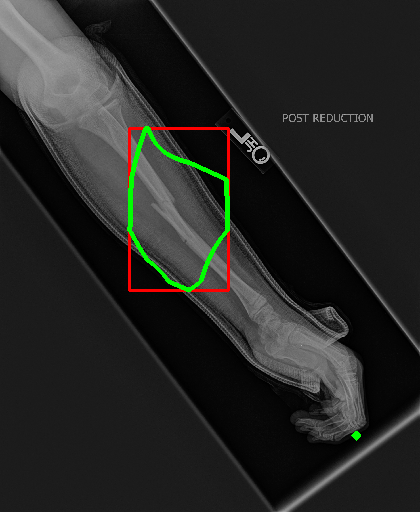

2. Grad-CAM built on the output of 4-st dense block

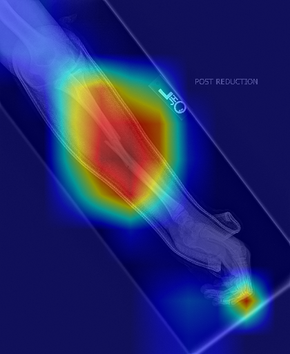
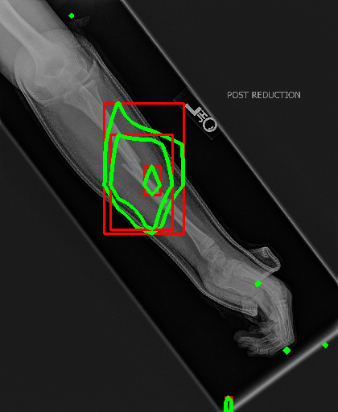

## II. Weakly supervised semantic segmentation

A representive framework for weakly supervised semantic segmentation:

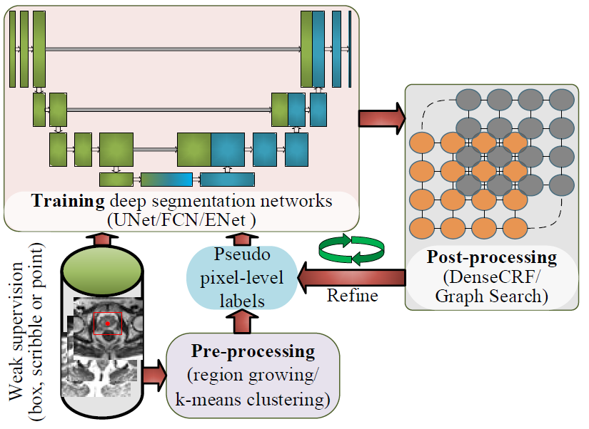

Besides, prior knowledge, such as target's size, shape, can be very useful for training deep models especially when facing weakly supervised situation. 

Here, we show how to embed prior knowledge into the training of deep models on weak labels and achieve similar segmentation results with those trained with fully supervision. The demo is based on [Constrained-CNN losses for weakly supervised segmentation](https://arxiv.org/abs/1805.04628).

### Methods

We build the demo of weakly supervised semantic segmentation on two methods：

- [ ] method 1: representive framework: pre-processing (region growing / K-means clustering) + ENet + post-processin (DenseCRF / Graph Search)

- [x] method 2: [Size Constrained-CNN](https://arxiv.org/abs/1805.04628): size constrained loss + ENet

### Dataset

We used the training set from the publicly available data of [the 2017 ACDC Challenge](https://www.creatis.insa-lyon.fr/Challenge/acdc/) . This set consists of 100 cine magneticresonance (MR) exams covering well defined pathologies:  dilated cardiomyopathy, hypertrophiccardiomyopathy, myocardial infarction with altered left ventricular ejection fraction and abnormalright ventricle.  It also included normal subjects.  The exams were acquired in breath-hold with aretrospective or prospective gating and a SSFP sequence in 2-chambers, 4-chambers and in short-axisorientations. A series of short-axis slices cover the LV from the base to the apex, with a thickness of 5 to 8 mm and an inter-slice gap of 5 mm. The spatial resolution goes from 0.83 to 1.75 mm2/pixel. For all the experiments, we employed the same 75 exams for training and the remaining 25 forvalidation. To increase the variability of the data, we augmented the dataset by randomly rotating, flipping, mirroring and scaling the images. 

### Results

#### 1. Weak labels

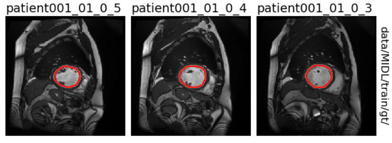

(a) Full supervision: gt

----

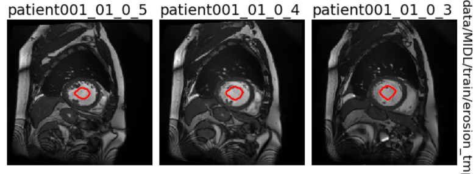

(b) weak supervision 1： erosion operation on gt

----

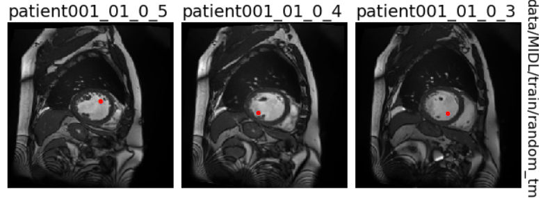

(c) weak supervision 2： random point supervision 

----

(d) weak supervision 3： centroid point supervision 

----

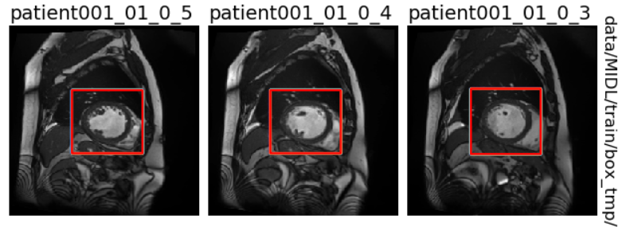

(e) weak supervision 4： box supervision

------

#### 2. [Size Constrained-CNN](https://arxiv.org/abs/1805.04628): size constrained loss + ENet

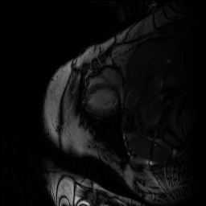

- (1). **fs**: full supervision (gt), cross entropy loss, val_dice: 0.8502

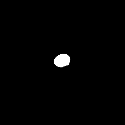

- (2). **partial**: weak supervision (erosion), partial cross entropy loss, val_dice: 0.1372

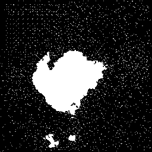

- (3). **loose**: weak supervision (erosion), partial cross entropy loss + 0.02*penalty (2d size constrain, 1~65000), val_dice: 0.6707

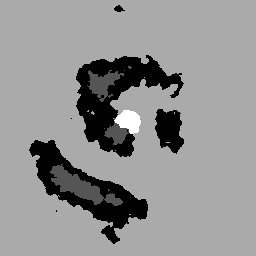

- (4). **size_595**: weak supervision (erosion), partial cross entropy loss + 0.02*penalty (2d size constrain, 60~2000), val_dice: 0.7072

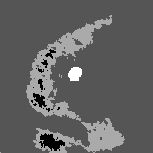

- (5). **presize_upper**: weak supervision (erosion), partial cross entropy loss + 0.05*penalty (2d size constrain, 1~size per sample * 110%]), val_dice: 0.6786

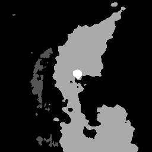

- (6). **presize**: weak supervision (erosion), partial cross entropy loss + 0.05*penalty (2d size constrain, size per sample * [90%,110%]), val_dice: 0.7655

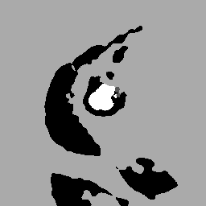

- (7). **3d_sizeloss**:  weak supervision (erosion), partial cross entropy loss + 0.02*penalty (**3d size constrain**, size per 3D sample * [100%,100%]), val_dice: 0.7876

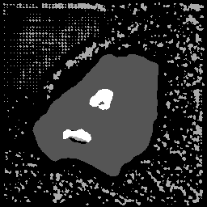

- (8). **3d_sizeloss_random**:  weak supervision (random point), partial cross entropy loss + 0.02*penalty (**3d size constrain**, size per 3D sample * [100%,100%]), val_dice: 0.7949

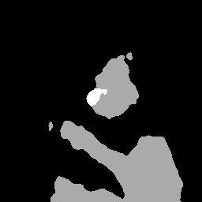
