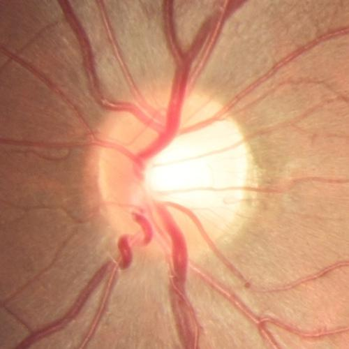
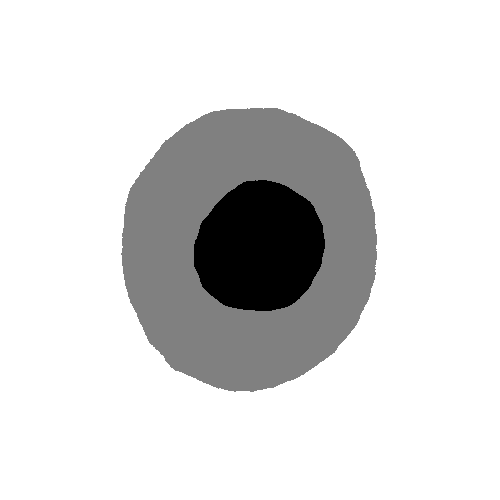

# Transfer Learning 

We build the demo of transfer learning techniques：

- [x] method 1: [Domain Adaptation through Adversarial Training](https://arxiv.org/pdf/1910.07638.pdf)

In this demo, two retinal fundus image datasets acquired with two different fundus cameras are regarded as source domain and target domain samples. Ground-true masks are provided only in source domain.


## Datasets

Source Domain: `Zeiss Visucam 500 (2124x2056 pixels) - 400 retinal fundus images For Training`;

Target Domain: `Canon CR-2 (1634x1634 pixels) - For 400 retinal fundus images for Validation and 400 retinal fundus images for Test`


## Task

- optic disc and cup segmentation

- the vertical cup to disc ratio


## baseline

UNet is trained on source domain dataset and applied in target domain.

## domain adversarial learning

UNet is trained with `Domain Discriminator` using both labeled samples in source domain and unlabeled samples in target domain. 

### iteration 9300

original image：



GT：


Result：




```python
Cup-Dice,Disc-Dice,AE-CDR

0.8245609283680616,0.8974849152726366,0.04796181102949557
```